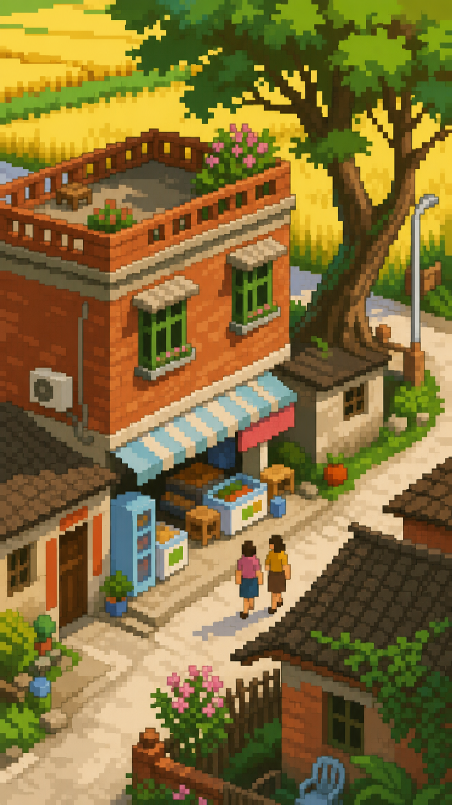
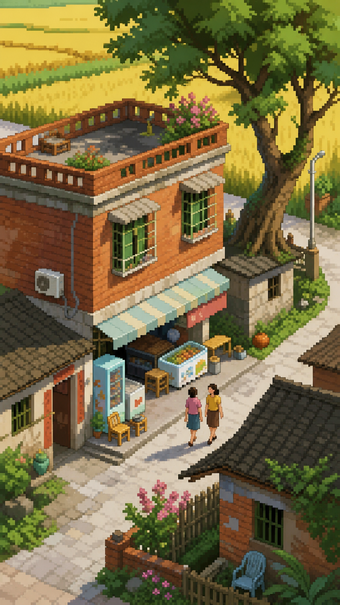
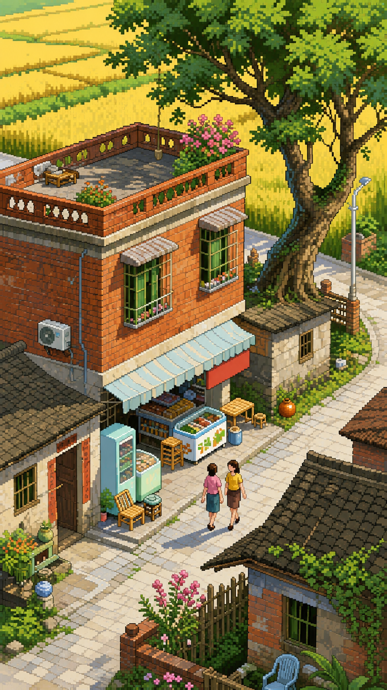

# Pixelize

Pixelize 是一个面向 Codex 的像素艺术生成 Skill。它可以把用户提供的人物、物体或场景图片重新绘制为结构清晰、像素簇统一的像素艺术，也可以根据文字描述直接生成像素风格画面。

它强调“重新组织信息并独立重绘”，而不是对原图进行缩小、马赛克化或套用像素滤镜。

## 主要能力

- 支持图片转像素艺术与文字生成像素艺术。
- 自动区分人物主体和场景主体，并采用不同的信息组织规则。
- 提供 `16`、`32`、`64` 三档细节预设。
- 图片转换默认保留主体、构图、比例、空间关系和原背景。
- 支持保留背景、纯白背景、透明背景或替换背景。
- 多档对比时独立重绘每一张图，避免由高细节结果直接缩小。
- 内置人物与场景的效果参考图，用于稳定像素簇尺度、信息密度和完成度。

## 16、32、64 代表什么

`16`、`32`、`64` 是画面细节与信息容量预设，不是最终图片必须输出为 `16×16`、`32×32` 或 `64×64` 像素。

| 预设 | 人物、物体 | 场景 |
| --- | --- | --- |
| `16` | 强化轮廓和识别特征，减少服装、表情及结构细节 | 保留空间骨架、明暗大关系和最重要的地标，合并重复元素 |
| `32` | 默认档位；保留清晰五官、服装分区和有限的阶梯明暗 | 保留完整空间关系、主要建筑分区、道路、植被块和少量叙事物件 |
| `64` | 使用更小的像素簇表现表情、服装、配件和物体结构 | 保留主要叙事信息和选定的材质细节，但仍抑制照片式噪点 |

三个预设会保持相同的画布比例和主体显示尺寸，只改变像素簇大小、结构分区数量与保留的信息量。

## 人物与场景分流

Pixelize 会在生成前判断内容类型：

- **人物主体**：人物、动物、角色或独立物体是主要识别对象，环境只是辅助信息。
- **场景主体**：建筑、室内、街道、景观、路线或空间布局是主要识别对象。

混合画面中，如果“认出地点和空间关系”比“认出某一个人物”更重要，则按场景处理。

## 安装

### 方法一：下载仓库

1. 下载或克隆本仓库。
2. 将仓库中的整个 `pixelize` 文件夹复制到 Codex 的 Skills 目录。
3. 重启 Codex，使新 Skill 被重新发现。

macOS / Linux：

```text
~/.codex/skills/pixelize
```

Windows：

```text
%USERPROFILE%\.codex\skills\pixelize
```

安装后的关键入口应为：

```text
~/.codex/skills/pixelize/SKILL.md
```

### 方法二：下载 ZIP

在 GitHub 仓库页面选择 **Code → Download ZIP**。解压后，将其中的 `pixelize` 子文件夹放入上述 Skills 目录。不要只复制 `SKILL.md`，否则人物、场景规范和效果参考图会缺失。

## 使用方法

在 Codex 中附加图片或输入文字需求，然后直接调用 `$pixelize`。如果不明确调用，当请求明显属于像素艺术转换或生成时，Codex 也可以自动识别此 Skill。

### 图片转像素艺术

```text
使用 $pixelize 把这张图片转换成 32 级像素艺术，保留原构图和背景。
```

默认行为：

- 使用 `32` 级细节。
- 保留原图比例、主体、姿态、构图和背景。
- 只改变绘制方式，不主动增加道具、改变人物身份或替换场景。

### 同时生成三档对比

```text
使用 $pixelize 分别生成这张图的 16、32、64 级效果，保持构图、比例和背景一致。
```

三张结果会分别重绘，而不是从同一张大图缩小得到。

### 根据文字生成

```text
使用 $pixelize 生成一张 32 级像素艺术：雨后的老街便利店，傍晚暖光，门口停着一辆自行车，竖版构图。
```

文字生成默认使用简单、易读的构图。可以继续指定视角、天气、光线、比例和重点元素。

### 控制背景

```text
使用 $pixelize 转换为 64 级人物像素艺术，透明背景。
```

```text
使用 $pixelize 转换为 32 级像素艺术，主体保持不变，把背景替换成夜晚车站。
```

支持以下背景模式：

- 保留原背景：图片转换的默认值。
- 纯白背景：适合角色设定图和商品主体。
- 透明背景：适合素材、贴纸和后续排版。
- 替换背景：仅在用户明确提出新场景时执行。

### 指定输出比例

```text
使用 $pixelize 生成 16 级横版场景，比例 16:9。
```

细节预设不会限制画布尺寸。用户可以单独指定横版、竖版、方形或具体宽高比。

## 效果参考

参考图只用于校准像素簇大小、信息密度、简化程度与完成度。生成新内容时，不会复制参考图中的人物、服装、姿态、建筑、构图、色彩或光线。

### 人物

| 16 级 | 32 级 | 64 级 |
| --- | --- | --- |
|  |  |  |

### 场景

| 16 级 | 32 级 | 64 级 |
| --- | --- | --- |
|  |  |  |

## 生成原则

Pixelize 要求结果具备以下特征：

- 方形、硬边、尺寸一致的像素簇。
- 清晰的轮廓、离散色阶和有目的的阶梯明暗。
- 有限且经过组织的色彩，不使用平滑渐变。
- 先保留轮廓、空间与识别特征，再决定次要细节。
- 场景文字无法可靠还原时，使用抽象像素标记保持招牌的位置和色彩节奏。

它会主动避免：抗锯齿、模糊像素、软焦、照片纹理、随机噪点、混合像素尺寸、机械马赛克和无意义文字。

## 目录结构

```text
pixelize/
├── SKILL.md
├── agents/
│   └── openai.yaml
├── references/
│   ├── pixel-style-guide.md
│   ├── scene-style-guide.md
│   └── effect-reference-guide.md
└── assets/
    └── effect-references/
        ├── character-16.png
        ├── character-32.png
        ├── character-64.png
        ├── scene-16.png
        ├── scene-32.png
        └── scene-64.png
```

## 使用要求

- 需要能够调用图像生成工具的 Codex 环境。
- 输入图片应尽量清晰；低清晰度、严重遮挡或主体过小会降低身份与结构保持能力。
- 极细文字、密集商品、单片叶子或砖块等信息会根据细节预设被合并、符号化或移除。
